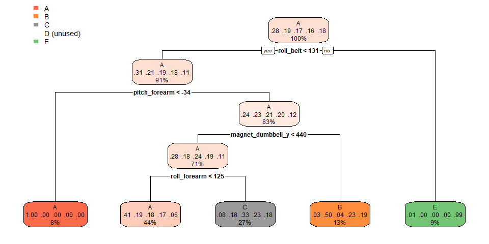
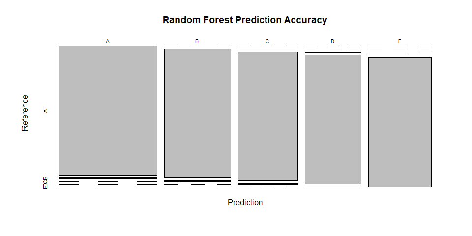
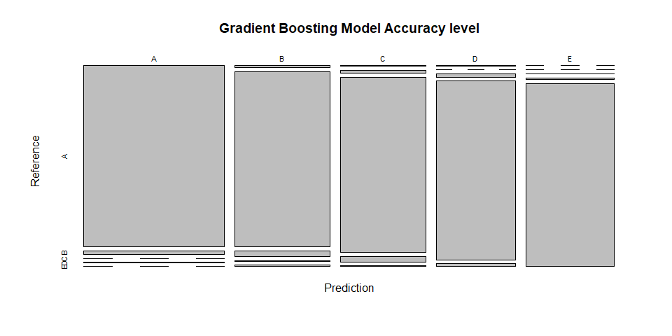

# Introduction
This project is conducted to predict the manner in which
a group of enthusiasts who take measurements about themselves regularly to improve their health, to find patterns in their behavior. Using devices such as Jawbone Up, Nike FuelBand, and Fitbit it is now possible to collect a large amount of data about personal activity relatively inexpensively. This report showed how the prediction model is built for this particular purpose, and are used to predict 20 different test cases.

## Data information

The training data for this project are available here: 

https://d396qusza40orc.cloudfront.net/predmachlearn/pml-training.csv

The test data are available here:

https://d396qusza40orc.cloudfront.net/predmachlearn/pml-testing.csv

The data for this project come from this source: http://groupware.les.inf.puc-rio.br/har. If you use the document you create for this class for any purpose please cite them as they have been very generous in allowing their data to be used for this kind of assignment. 


### Loading packages require to run the codes


```r
library(dplyr)
library(ggplot2)
library(caret)
library(AppliedPredictiveModeling)
library(pgmm)
library(rpart)
library(lubridate)
library(forecast)
library(e1071)
library(ElemStatLearn)
library(gbm)
library(elasticnet)
library(rpart.plot)
```

### Loading data sets into R

```r
data_test <- read.csv("pml-testing.csv", header = TRUE, na.strings = c("NA", "#DIV/0!", ""))
data_train <- read.csv("pml-training.csv", header = TRUE, na.strings = c("NA", "#DIV/0!", ""))
```


### Removing columns that have NA as 95% of the observations for both data set

```r
col_na_filter <- colSums(is.na(data_train))/nrow(data_train) < 0.95
training_data <- data_train[, col_na_filter == TRUE]
testing_data <- data_test[, col_na_filter == TRUE]
```


### Checking the two data sets have been successfully filtered

```r
dim(training_data)
```

```
## [1] 19622    60
```

```r
dim(testing_data)
```

```
## [1] 20 60
```

## Removing the first 7 variables which do not related to the training model.

```r
training_data <- training_data[,-c(1:7)]
testing_data <- testing_data[,-c(1:7)]
```

### Double check the we dont filtered out classe and problem_id

```r
colnames(training_data)
```

```
##  [1] "roll_belt"            "pitch_belt"           "yaw_belt"            
##  [4] "total_accel_belt"     "gyros_belt_x"         "gyros_belt_y"        
##  [7] "gyros_belt_z"         "accel_belt_x"         "accel_belt_y"        
## [10] "accel_belt_z"         "magnet_belt_x"        "magnet_belt_y"       
## [13] "magnet_belt_z"        "roll_arm"             "pitch_arm"           
## [16] "yaw_arm"              "total_accel_arm"      "gyros_arm_x"         
## [19] "gyros_arm_y"          "gyros_arm_z"          "accel_arm_x"         
## [22] "accel_arm_y"          "accel_arm_z"          "magnet_arm_x"        
## [25] "magnet_arm_y"         "magnet_arm_z"         "roll_dumbbell"       
## [28] "pitch_dumbbell"       "yaw_dumbbell"         "total_accel_dumbbell"
## [31] "gyros_dumbbell_x"     "gyros_dumbbell_y"     "gyros_dumbbell_z"    
## [34] "accel_dumbbell_x"     "accel_dumbbell_y"     "accel_dumbbell_z"    
## [37] "magnet_dumbbell_x"    "magnet_dumbbell_y"    "magnet_dumbbell_z"   
## [40] "roll_forearm"         "pitch_forearm"        "yaw_forearm"         
## [43] "total_accel_forearm"  "gyros_forearm_x"      "gyros_forearm_y"     
## [46] "gyros_forearm_z"      "accel_forearm_x"      "accel_forearm_y"     
## [49] "accel_forearm_z"      "magnet_forearm_x"     "magnet_forearm_y"    
## [52] "magnet_forearm_z"     "classe"
```

```r
colnames(testing_data)
```

```
##  [1] "roll_belt"            "pitch_belt"           "yaw_belt"            
##  [4] "total_accel_belt"     "gyros_belt_x"         "gyros_belt_y"        
##  [7] "gyros_belt_z"         "accel_belt_x"         "accel_belt_y"        
## [10] "accel_belt_z"         "magnet_belt_x"        "magnet_belt_y"       
## [13] "magnet_belt_z"        "roll_arm"             "pitch_arm"           
## [16] "yaw_arm"              "total_accel_arm"      "gyros_arm_x"         
## [19] "gyros_arm_y"          "gyros_arm_z"          "accel_arm_x"         
## [22] "accel_arm_y"          "accel_arm_z"          "magnet_arm_x"        
## [25] "magnet_arm_y"         "magnet_arm_z"         "roll_dumbbell"       
## [28] "pitch_dumbbell"       "yaw_dumbbell"         "total_accel_dumbbell"
## [31] "gyros_dumbbell_x"     "gyros_dumbbell_y"     "gyros_dumbbell_z"    
## [34] "accel_dumbbell_x"     "accel_dumbbell_y"     "accel_dumbbell_z"    
## [37] "magnet_dumbbell_x"    "magnet_dumbbell_y"    "magnet_dumbbell_z"   
## [40] "roll_forearm"         "pitch_forearm"        "yaw_forearm"         
## [43] "total_accel_forearm"  "gyros_forearm_x"      "gyros_forearm_y"     
## [46] "gyros_forearm_z"      "accel_forearm_x"      "accel_forearm_y"     
## [49] "accel_forearm_z"      "magnet_forearm_x"     "magnet_forearm_y"    
## [52] "magnet_forearm_z"     "problem_id"
```


# Creating data partition

```r
set.seed(1234)
inTrain = createDataPartition(y =training_data$classe, p = 3/4, list = FALSE)
training = training_data[ inTrain,]
testing = training_data[-inTrain,]
dim(training)
```

```
## [1] 14718    53
```

```r
dim(testing)
```

```
## [1] 4904   53
```

##  Cross validation

```r
control <- trainControl(method = "cv", number = 3)
```

### Predict with decision tree and confusion matrix

```r
model_rpart <- train(classe ~ ., data = training, method = "rpart", trControl = control)
predict_rpart <- predict(model_rpart, testing)
rpart_cm <- confusionMatrix(predict_rpart, testing$classe)
```

```r
rpart.plot(model_rpart$finalModel)
```

<!-- -->

They showed that this model only has ~50% predication accuracy on the training data, which is not consider as a good model. 

### Random Forest model

```r
model_rf <- train(classe ~ ., data = training, method = "rf", ntree = 100, trControl = control)
predict_rf <- predict(model_rf, testing)
rf_cm <- confusionMatrix(predict_rf, testing$classe)
```

Plotting RF accuracy

```r
plot(rf_cm$table, main = "Random Forest Prediction Accuracy")
```

<!-- -->
It shows that the Random Forest Predication model has an accuracy of ~99%, which is a very high 

### Gradient Boosting Model

```r
model_gbm <- train(classe ~ ., data = training, method = "gbm", verbose = FALSE, trControl = control)
predict_gbm <- predict(model_gbm, testing)
gbm_cm <- confusionMatrix(predict_gbm, testing$classe)
```

### Plotting GBM accuracy

```r
plot(gbm_cm$table, main = "Gradient Boosting Model Accuracy level")
```

<!-- -->

# Model selection
Comparing the appropriate model which has the highest predication accuracy for the dataset.


```r
compare <- data.frame(Model = c("Decision Trees (CART)", "Random Forest", "Gradient Boosting"),
                      Accuracy = rbind(rpart_cm$overall[1], rf_cm$overall[1], 
                                       gbm_cm$overall[1]))

compare
```

```
##                   Model  Accuracy
## 1 Decision Trees (CART) 0.4944943
## 2         Random Forest 0.9944943
## 3     Gradient Boosting 0.9677814
```

# Conclusion

Random forest model has a higher prediction accuracy (~99%) followed by Gradient Boosting Model (~97%) then Decision Trees model (~50%). As a result, we will use the RF model to predict the test data.


# Predicting test-data

```r
pre_rf_test <- predict(model_rf, testing_data)
pred_result <- data.frame(Problem_id = testing_data$problem_id,
                          Prediction_outcome = pre_rf_test)
pred_result
```

```
##    Problem_id Prediction_outcome
## 1           1                  B
## 2           2                  A
## 3           3                  B
## 4           4                  A
## 5           5                  A
## 6           6                  E
## 7           7                  D
## 8           8                  B
## 9           9                  A
## 10         10                  A
## 11         11                  B
## 12         12                  C
## 13         13                  B
## 14         14                  A
## 15         15                  E
## 16         16                  E
## 17         17                  A
## 18         18                  B
## 19         19                  B
## 20         20                  B
```
